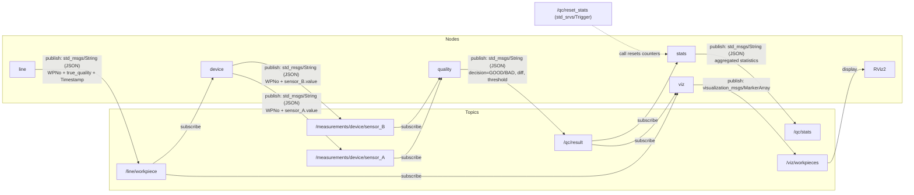

# izs_gm2_productionsim

An example ROS 2 package implementing a small manufacturing-line simulation and a simple quality-control pipeline.

---

## Overview

This project simulates a tiny production line with a QC (quality control) flow:

- **`line`** generates workpieces periodically (JSON payloads).
- **`device`** simulates two sensors (**A** and **B**) and publishes noisy measurements for each workpiece.
- **`quality`** pairs A/B measurements by `WPNo`, computes a difference, and publishes a QC decision (**GOOD/BAD**).
- **`stats`** aggregates QC results and provides a reset service.
- **`viz`** (optional) publishes RViz2 markers (MarkerArray) to visualize the workpieces on a simple “belt”.

This repository contains the nodes and a launch file to run the simulation end-to-end.

---

## Features

- Workpiece generation with configurable rate and defect probability
- Simulated measuring device producing two noisy sensors (A and B)
- Pairing logic by `WPNo` and QC decision based on sensor difference
- Runtime statistics publishing and a reset service
- Optional RViz2 visualization (MarkerArray) via the `viz` node

---

## Requirements

- ROS 2 (tested with **Foxy**)
- Python 3.8+ (the system used Python 3.10)
- ROS 2 packages: `rclpy`, `launch`, `launch_ros`, `std_msgs`, `std_srvs`
- Optional visualization: `visualization_msgs` (and RViz2)

---

## Quick start

### 1. Prepare a ROS 2 workspace and clone into `src`
```bash
cd ~/ros2_ws/src
git clone https://github.com/izsor/izs_gm2_productionsim.git
```

### 2. (Optional) Install system dependencies with `rosdep`:

```bash
cd ~/ros2_ws
rosdep update
rosdep install --from-paths src --ignore-src -r -y
```

### 3. Build and source the workspace:

```bash
cd ~/ros2_ws
colcon build --packages-select izs_gm2_productionsim --symlink-install
source install/setup.bash
```

### 4. Launch the simulation:

```bash
ros2 launch izs_gm2_productionsim productionsim.launch.py
```

Available executables (entry points)
- `line` → `izs_gm2_productionsim.line_node:main`
- `device` → `izs_gm2_productionsim.measure_node:main`
- `quality` → `izs_gm2_productionsim.quality_node:main`
- `stats` → `izs_gm2_productionsim.stats_node:main`
- `viz` → `izs_gm2_productionsim.viz_node:main`

To list installed executables after sourcing the workspace:

```bash
ros2 pkg executables izs_gm2_productionsim
```
## Interfaces
### Topics
- `/line/workpiece` — `std_msgs/String` (JSON: `WPNo`, `true_quality`, `Timestamp`)
- `/measurements/device/sensor_A` — `std_msgs/String` (JSON with `sensor_A` and `WPNo`)
- `/measurements/device/sensor_B` — `std_msgs/String` (JSON with `sensor_B` and `WPNo`)
- `/qc/result` — `std_msgs/String` (QC decision payload)
- `/qc/stats` — `std_msgs/String` (aggregated statistics)

### Services
- `/qc/reset_stats` — `std_srvs/Trigger` (reset counters)

### Parameters

#### `line`
- **`rate_sec` (float)**  
  How often a new workpiece is generated, in seconds.  
  *Example:* `rate_sec=1.0` → one workpiece every 1 second; `rate_sec=0.5` → two per second.

- **`defect_prob` (float)**  
  Probability that a generated workpiece is defective (`BAD`). Range: `0.0 … 1.0`.  
  *Example:* `defect_prob=0.25` → ~25% of workpieces are marked as defective in the “ground truth”.

#### `device`
- **`noise` (float)**  
  Measurement noise added to sensor values. Higher value → noisier measurements → harder QC decision.  
  *Effect:* increasing `noise` increases overlap between GOOD/BAD measurements, so more misclassifications can happen.

- **`base_A_good`, `base_B_good` (float)**  
  Baseline (ideal) sensor readings for a **GOOD** workpiece for sensors **A** and **B** (before noise).

- **`base_A_bad`, `base_B_bad` (float)**  
  Baseline (ideal) sensor readings for a **BAD** workpiece for sensors **A** and **B** (before noise).

> Intuition: the baselines define the expected “signature” of GOOD vs BAD parts. Since the QC step uses the difference between B and A, the separation between these baselines strongly affects the decision quality.

#### `quality`
- **`diff_threshold` (float)**  
  Decision threshold used after pairing sensor A and B for the same `WPNo`.  
  The node computes: `diff = sensor_B - sensor_A` and compares it to the threshold to decide GOOD/BAD (or OK/NOK).  
  *Lower threshold* → stricter (more BAD/NOK). *Higher threshold* → more permissive (more GOOD/OK).

- **`log_pairs` (bool)**  
  If `true`, prints extra logs when it successfully pairs A/B measurements for a workpiece (useful for debugging).  
  If `false`, runs quieter.

- **`drop_after_sec` (float)**  
  Timeout for incomplete pairs. If only sensor A or only sensor B arrives for a given `WPNo`, the node keeps it in a buffer temporarily.  
  If the matching measurement does not arrive within `drop_after_sec`, the partial record is dropped to prevent memory growth and stale decisions.  
  *Example:* `drop_after_sec=2.0` → drop orphaned sensor readings older than 2 seconds.

### Examples
- Run a single node manually (after sourcing):

```bash
ros2 run izs_gm2_productionsim line
```

- Inspect published messages:

```bash
ros2 topic echo /line/workpiece
ros2 topic echo /qc/result
```

###Troubleshooting
- If the launch fails with a syntax error, check that `launch/productionsim.launch.py` is a valid Python launch file and not a leftover text file.
- If console scripts are missing, ensure `setup.py` contains the `entry_points` and rebuild + source the workspace.


Mermaid diagram (visual topology)


License
- GPL-3.0

