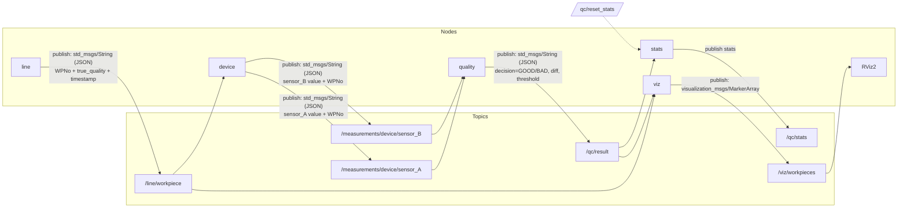

# izs_gm2_productionsim

An example ROS 2 package implementing a small manufacturing-line simulation and simple quality-control pipeline.

Overview
- The `line` node generates workpieces (JSON payloads) periodically.
- The `device` node simulates two sensors (A and B) that publish noisy measurements for each workpiece.
- The `quality` node pairs A/B measurements by `WPNo`, computes a difference, and publishes a QC decision.
- The `stats` node aggregates QC results and provides a reset service.

This repository contains basic nodes and a launch file to run the simulation end-to-end.

Features
- Workpiece generation with configurable rate and defect probability
- Simulated measuring device producing two noisy sensors (A and B)
- Pairing logic by `WPNo` and QC decision based on sensor difference
- Runtime statistics publishing and a reset service
- Optional RViz2 visualization (MarkerArray) via the `viz` node

Requirements
- ROS 2 (tested with Foxy)
- Python 3.8+ (the system used Python 3.10)
- ROS 2 packages: `rclpy`, `launch`, `launch_ros`, `std_msgs`, `std_srvs`, `visualization_msgs` (optional)

Quick start
1. Prepare a ROS 2 workspace and clone the repository into `src`:

```bash
cd ~/ros2_ws/src
git clone https://github.com/izsor/izs_gm2_productionsim.git
```

2. (Optional) Install system dependencies with `rosdep`:

```bash
cd ~/ros2_ws
rosdep update
rosdep install --from-paths src --ignore-src -r -y
```

3. Build and source the workspace:

```bash
cd ~/ros2_ws
colcon build --packages-select izs_gm2_productionsim --symlink-install
source install/setup.bash
```

4. Launch the simulation:

```bash
ros2 launch izs_gm2_productionsim productionsim.launch.py
```

Available executables (entry points)
- `line` → `izs_gm2_productionsim.line_node:main`
- `device` → `izs_gm2_productionsim.measure_node:main`
- `quality` → `izs_gm2_productionsim.quality_node:main`
- `stats` → `izs_gm2_productionsim.stats_node:main`
- `viz` → `izs_gm2_productionsim.viz_node:main` (if present)

To list installed executables after sourcing the workspace:

```bash
ros2 pkg executables izs_gm2_productionsim
```

Topics
- `/line/workpiece` — `std_msgs/String` (JSON: `WPNo`, `true_quality`, `Timestamp`)
- `/measurements/device/sensor_A` — `std_msgs/String` (JSON with `sensor_A` and `WPNo`)
- `/measurements/device/sensor_B` — `std_msgs/String` (JSON with `sensor_B` and `WPNo`)
- `/qc/result` — `std_msgs/String` (QC decision payload)
- `/qc/stats` — `std_msgs/String` (aggregated statistics)

Services
- `/qc/reset_stats` — `std_srvs/Trigger` (reset counters)

Parameters
- `line`: `rate_sec` (float), `defect_prob` (float)
- `device`: `noise` (float), `base_A_good`, `base_B_good`, `base_A_bad`, `base_B_bad`
- `quality`: `diff_threshold` (float), `log_pairs` (bool), `drop_after_sec` (float)

Examples
- Run a single node manually (after sourcing):

```bash
ros2 run izs_gm2_productionsim line
```

- Inspect published messages:

```bash
ros2 topic echo /line/workpiece
ros2 topic echo /qc/result
```

Troubleshooting
- If the launch fails with a syntax error, check that `launch/productionsim.launch.py` is a valid Python launch file and not a leftover text file.
- If console scripts are missing, ensure `setup.py` contains the `entry_points` and rebuild + source the workspace.

Notes on the Mermaid diagram
- The original README included a Mermaid diagram that was not rendered on all platforms. A working Mermaid code block has been added below; some renderers (e.g. GitHub) require Mermaid support to be enabled.

Mermaid diagram (visual topology)


License
- GPL-3.0

